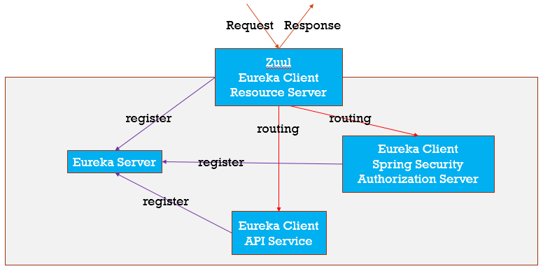
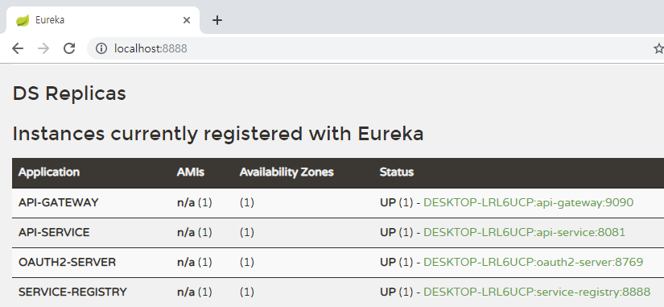
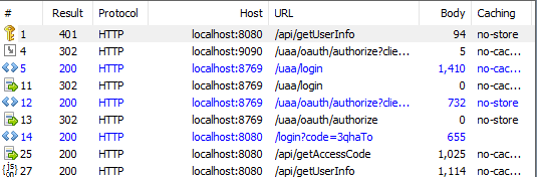
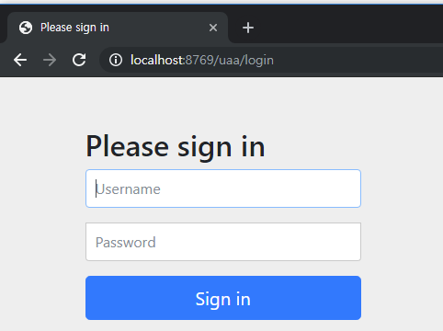
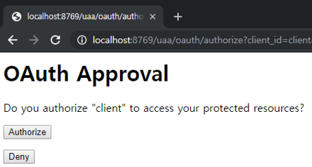

Security for Microservices
==========================
# Target
* API Service를 제공하는 **Microservices Architecture**를 Spring Framework를 통해 구현
  * **Spring version** : Greanwich
  * **Spring Cloud Netfilx** 사용
    * **Eureka** : Client Side Service Discovery Server 
    * **Zuul** : JVM-based router and server-side load balancer

* **OAuath 2.0**을 이용한 접근권한 인증
	* **Spring Security** 사용
    * **Authorization Code Grant** 방법으로 구현
    * [JWT(JSON Web Tokens)](https://jwt.io/introduction/) 사용
      * Token 속에 사용자, 권한 정보 등을 json 형태로 저장

# Project Structure
## service-registry
* Client Side Service Discovery Server (Eureka Server)
* MSA 환경에서 서비스 클라이언트가 서비스를 호출할때 서비스의 위치를 알아낼 수 있는 기능을 제공
* Eureka Client의 heartbeat를 받아서 service의 상태를 관리
* Standalone으로 동작, 또는 Peer를 등록해서 사용도 가능
* **@EnableEurekaServer** annotation으로 설정

	**application.yml (Standalone Eureka Server).**
	
		...
		eureka:
		  instance:
		    hostname: localhost
		  client:
		    registerWithEureka: false # eureka server registry에 등록할 것인지 여부 ( default : true )
		    fetchRegistry: false # eureka server에서 client 정보를 읽을 것인지 여부 ( default : true)
		    serviceUrl:
		      defaultZone: http://${eureka.instance.hostname}:${server.port}/eureka/
		 ...

* references : [Spring Cloud Netfilx(Eureka Server)](https://cloud.spring.io/spring-cloud-static/spring-cloud-netflix/2.1.2.RELEASE/single/spring-cloud-netflix.html#spring-cloud-eureka-server), [Spring Cloud Netfilx(Eureka Client)](https://cloud.spring.io/spring-cloud-static/spring-cloud-netflix/2.1.2.RELEASE/single/spring-cloud-netflix.html#_service_discovery_eureka_clients)

## gateway
* **Zuul**과 **Spring Security**를 이용하여 구성
  * **Zuul**
    * JVM-based router and server-side load balancer
    * **@EnableZuulProxy** annotation으로 설정

    * **application.yml (Zuul)**
	
		    ...
		    zuul:
			   ignoredServices: '*' # 요청을 무시할 패턴 설정, routes에 정의된 요청은 통과함
			   routes:
			      api:
			         path: /api/**	# 요청이 들어올 패턴
			         serviceId: api-service # routing할 서비스 
			         stripPrefix: true	# path를 제거하고 포워딩 할것인지 여부
			      oauth:
			         sensitiveHeaders: # 외부로 나가는 header 중 제외할 항목
			         path: /uaa/**
			         serviceId: oauth2-server
			         stripPrefix: false
			   addProxyHeaders: true # proxy header의 추가 여부 (X-Forwarded-Host)
			...
	
  * **Spring Security**
    * **@EnableResourceServer** annotation으로 Resource Server 역할을 부여
    * **ResourceServerConfigurerAdapter**의 **configure(HttpSecurity http)** 메서드 오버라이드를 통해서 접근 권한을 설정
	* **ResourceServerConfig.java**
		  
		  ...
          @Override
	      public void configure(HttpSecurity http) throws Exception {
	    	 http
	    		 .authorizeRequests()
	    			 .antMatchers("/uaa/**", "/login", "/logout").permitAll()
	    			 .antMatchers("/api/admin/**").hasRole("ADMIN")
	    			 .antMatchers("/api/user/**").hasAnyRole("ADMIN", "USER")
	    			 .antMatchers("/api/guest/**").permitAll()
	    			 .anyRequest().authenticated();
	      }
	      ...
	* JWT 방식을 사용할 경우 토큰을 decode할 key 설정이 필요
	* **application.yml**
	
	      ...
	      security:
		   oauth2:
		      resource:
		         jwt:
		            key-value: |
		               -----BEGIN PUBLIC KEY-----
		               MIGfMA0GCSqGSIb3DQEBAQUAA4...
		               -----END PUBLIC KEY-----
		  ...
		               
  * references : [Zuul](https://cloud.spring.io/spring-cloud-static/spring-cloud-netflix/2.1.2.RELEASE/single/spring-cloud-netflix.html#_router_and_filter_zuul), [Spring Security(Resource Server)](https://docs.spring.io/spring-security-oauth2-boot/docs/current/reference/html/boot-features-security-oauth2-resource-server.html#boot-features-security-oauth2-resource-server)
  

## oauth2-server
* **인증(Authentication)**
  * **@EnableWebSecurity** annotation으로 인증 기능 적용
  * **application.yml**
  
  		...
  		security:
		   basic:
		      enabled: false	# HTTP basic 인증 disable
		   ignored: /css/**,/js/**,/favicon.ico,/webjars/**		# 인증 제외할 패턴
		...
		   
  * Authentication customize
    * **UserDetailsService**를 상속받아서 사용자 인증을 구현
    * **UserDetailsServiceImpl.java**
    
       	  @Service
		  public class UserDetailsServiceImpl implements UserDetailsService {
			@Autowired
			private UserRepository userRepository;
			@Override
			public UserDetails loadUserByUsername(String username) throws UsernameNotFoundException {
				User user = userRepository.findByUsername(username);
				if (user == null) {
					throw new UsernameNotFoundException("UsernameNotFound [" + username + "]");
				}
				return LoginUser.Builder()
						.username(user.getUsername())
						.password(user.getPassword())
						.role(user.getRole())
						.build();
			}
		  }
		  
  * PasswordEncoder customize
    * **WebSecurityConfig.java**
    
          ...
          @Autowired
		  private UserDetailsService userDetailsService;
			
		  @Bean
		  public PasswordEncoder passwordEncoder() {
		      return new BCryptPasswordEncoder();
		  }
			
		  @Override
		  protected void configure(AuthenticationManagerBuilder auth) throws Exception {
				auth
					.userDetailsService(userDetailsService)
						.passwordEncoder(passwordEncoder());
		  }
		  ...
  		
  * references : [Spring Security](https://docs.spring.io/spring-security/site/docs/5.1.5.RELEASE/reference/htmlsingle/), [UserDetailService](https://docs.spring.io/spring-security/site/docs/5.1.5.RELEASE/reference/htmlsingle/#jc-authentication-userdetailsservice), [PasswordEncoder](https://docs.spring.io/spring-security/site/docs/5.1.5.RELEASE/reference/htmlsingle/#core-services-password-encoding)

* **권한부여(Authorization)**
  * **@EnableAuthorizationServer** annotation으로 권한부여 기능 적용
  * Client Details 설정
    * JdbcClientDetailsService 를 사용 ([참고용 Schema](https://github.com/spring-projects/spring-security-oauth/blob/master/spring-security-oauth2/src/test/resources/schema.sql))
    * **AuthorizationServerConfig.java**
  
          ...
          @Autowired
		  private DataSource dataSource;
	
	      @Override
	      public void configure(ClientDetailsServiceConfigurer clients) throws Exception {
	    	clients.jdbc(dataSource);
	      }
	      ...
  
  * Token 관리
    * JwtTokenStore를 사용
    * **AuthorizationServerConfig.java**
        
            ...
            @Override
			public void configure(AuthorizationServerEndpointsConfigurer endpoints) throws Exception {
				endpoints.tokenStore(tokenStore())
				.accessTokenConverter(accessTokenConverter());
			}			
		    @Bean
		    public TokenStore tokenStore() {
		        return new JwtTokenStore(accessTokenConverter());
		    }		
			@Bean
			public JwtAccessTokenConverter accessTokenConverter() {
				JwtAccessTokenConverter converter = new JwtAccessTokenConverter();
				KeyPair keyPair = new KeyStoreKeyFactory(new ClassPathResource("server.jks"), "bis5970911".toCharArray())
						.getKeyPair("server_private", "bis5970911".toCharArray());
				converter.setKeyPair(keyPair);						
				return converter;
			}
			...
    
    
  * references : [Spring Security OAuth2](https://docs.spring.io/spring-security-oauth2-boot/docs/current-SNAPSHOT/reference/htmlsingle/), [OAuth 2 Developers Guide](https://projects.spring.io/spring-security-oauth/docs/oauth2.html)
    
    
## api-service
* 테스트용으로 Admin, User, Guest api를 하나의 api-service에서 제공
    
 
    
# Test
### Microservices - Eureka server 구동 확인

---
### OAuth 2.0 login

1. Access Token을 받기 전에 /api/getUserInfo 요청하지만 401 Error
2. /uaa/oauth/authorize 호출
3. 인증되지 않은 사용자의 요청이므로 /uaa/login 으로 302 redirect

4. Resource Owner가 인증을 완료하면 /uaa/oauth/authorize 로 302 redirect
5. Authorization code를 response의 파라미터로 전달
6. 획득한 authorization code로 /uaa/oauth/token 호출해서 Access Token을 획득
7. Access Token을 이용해 /api/getUserInfo 요청하여 200 성공